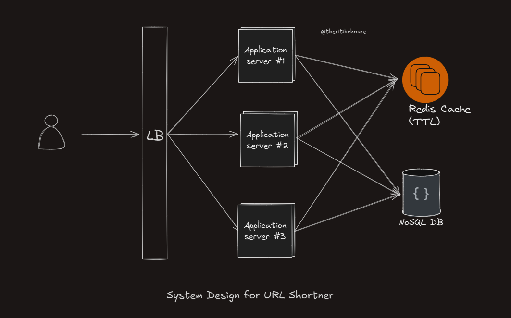

# URL Shortener System Design

This repository contains the implementation of a URL shortener service designed to efficiently handle a high volume of URL shortening requests while ensuring scalability and minimal collision risk. The system is capable of generating short URLs and managing user analytics.




<video controls>
  <source src="./itiny-url-shortener-demo.mp4" type="video/mp4">
  Your browser does not support the video tag.
</video>


## Key Components

### URL Shortener Service:

- Endpoint: `/api/url/shorten`
    - Functionality: Generates a short URL from a given long URL.
    - Storage: Short URLs are stored in MongoDB with their corresponding long URLs.

- Endpoint: `/api/url/:shortUrl`
    - Functionality: Retrieves the long URL from Redis or MongoDB and logs analytics asynchronously.
    Error Handling:


### Redis Cache:

- Purpose: Caches the mapping between short URLs and long URLs to improve read performance.
- TTL: Each cached URL mapping has a time-to-live (TTL) of 1 hour.


## Data estimation

Each second we are generating 1000 short urls

- No. of unique urls needed for atleast 10 years

    seconds in a year: 60*60*24*365 = 31.5M
    Total seconds in 10 years: 31.5M*10 = 315M
    Total urls in 10 years: 315M*1000 = 315B


### No. of unique urls generated

For a short ID length of 7 characters, using the character set [a-z, A-Z, 0-9] (which has 62 possible characters), the number of unique combinations can be calculated as follows:

**Calculation** - (62)^7

let's compute it - (62)^7 = 3.5 Trillion Urls

This provides a large enough space to minimize the chances of collisions in most applications.

## Scalability Considerations

- Database: MongoDB handles long-term storage of URL mappings.
- Caching: Redis provides a high-speed cache for frequently accessed short URL mappings.
- Load Balancing: NGINX or similar tools can be used to distribute incoming requests across multiple instances of the URL shortener service.
- Rate Limiting: Implemented to protect against abuse and ensure fair usage of resources.

## Installation

1. Clone the Repository:
    ```
    git clone https://github.com/yourusername/url-shortener.git
    cd url-shortener
    ```

2. Install Dependencies:
    ```
    npm install
    ```

3. Configure Environment Variables:
    - Create a .env file in the root directory and add the necessary configuration values (e.g., MongoDB URI, Redis URL).

4. Run the Application:
    ```
    npm start
    ```

